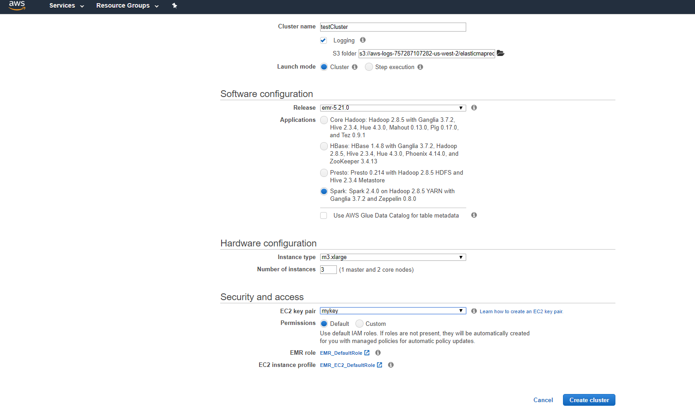
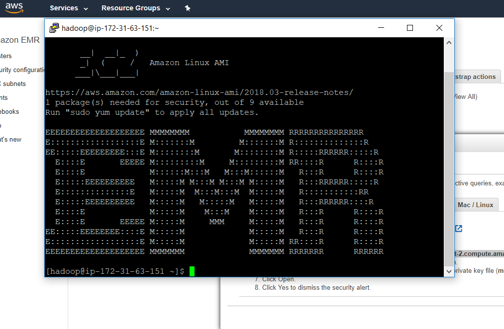
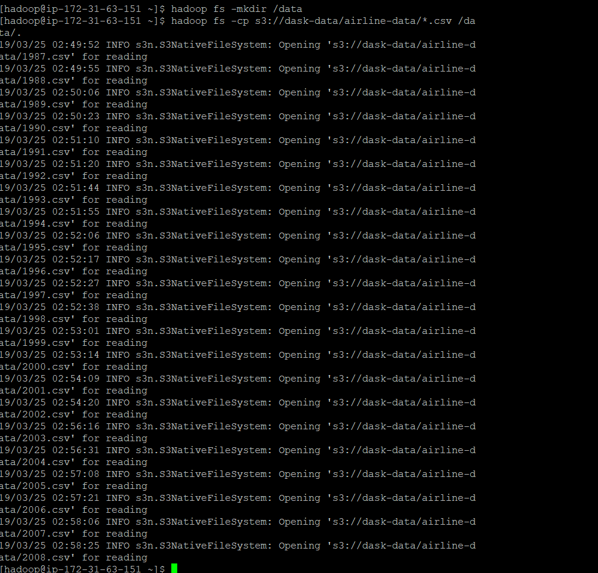
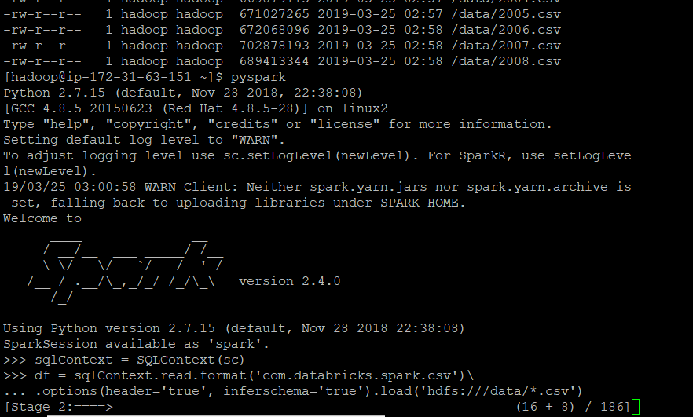
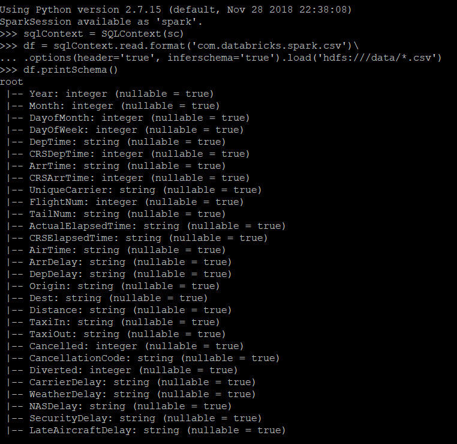
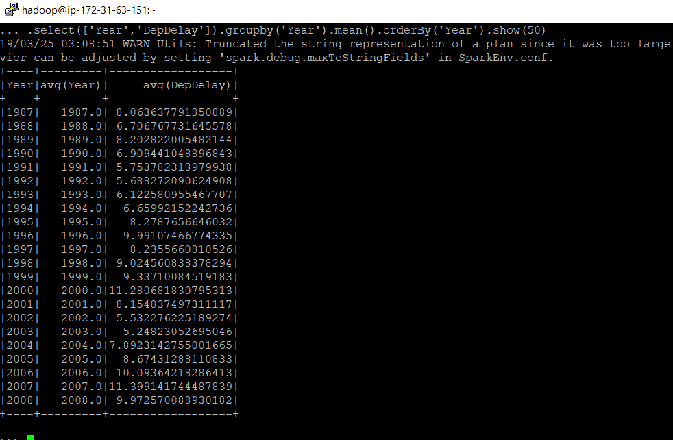
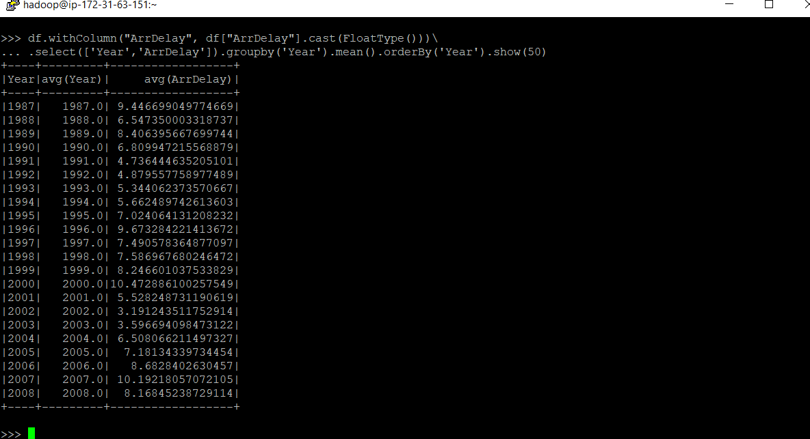
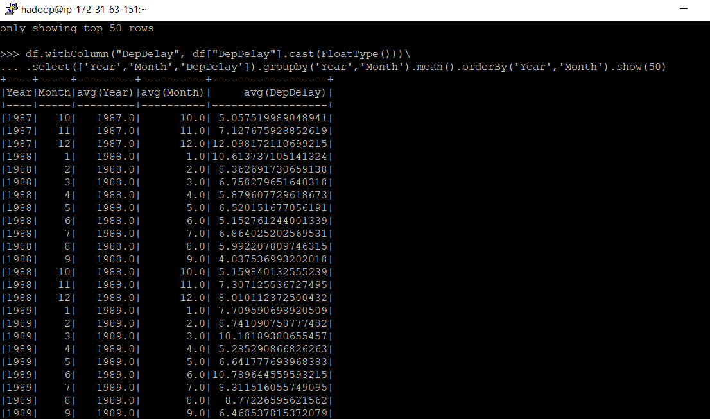

# Creating a Spark Cluster on AWS with 120 Million Flight Records
## Testing Spark on AWS


### Spark on AWS
I haven't had much exposure on AWS, considering that most of my work is on local databases like a SQL Server or PostgreSQL, but recently I have been exploring new database options. Spark has been on my list and I thought this a good moment to refresh on AWS and start familiarizing myself with more of what Amazon has to offer. I found a great tutorial by Zachariah W. Miller in which he covers spinning up a cluster and utilizing over 120 million flight records to test the effectiveness of spark as an anlaytics tool. Zack doesn't cover the costs but for those following my process it cost me about 2 bucks to play on this cluster for an hour. Not too shabby!

### Initiating the Cluster
You'll want to make an account on AWS and then search for the EMR service in your console. Once you enter hit create a cluster and you should see the following: 



You'll want to name your cluster and set up 3 nodes; also pick the last option that installs spark 2.4.0 in your configuration. Your cluster will comprise of a master node and the worker nodes under it. In addition to choosing the amount of nodes, you will also want to pick a key pair. A key pair allows you access to your instance through SSH so that you can go on your computer and enter the AWS master node. If you are just starting off then you will have to create a new one; as is often the case with microsoft windows in programming and data, things are more difficult than MacOS or Linux. First download putty, then you'll want to create a key pair and convert that key pair with puttygen. Once you select your key pair click create cluster. If you're a raspberrypi fan like myself this should be pretty familiar.

The cluster will take 5-10 minutes to finish initializing at which moment you will see waiting . . . Once you see this you can attempt to SSH into your master node. Note that when I tried this there was an issue with the master node; if you get a timeout error you need to go to your security group settings and add a rule for allowing any connection. Once you have this set up you can SSH in through puttygen, simply follow the instructions provided on SSH section next to your master public ip: 


SSH instruction will appear when you click SSH

And if all goes well you should get the following: 



made it this far!

### Loading the Data

Now we will load the flight data; Amazon provides this data for testing it seems and we can grab it from S3 buckets that hold the raw csv files. This data has over 120 million records making it a good start to testing your big data chops (maybe more like medium data, even taxi data isn't really that big). Since your are using AWS EMR to run this cluster the software has already installed Hadoop for you so loading data in HDFS format is easy. You can create a directory and load the data in:
```
hadoop fs -mkdir /data #create a directory to mount the data
hadoop fs -cp s3://dask-data/airline-data/*.csv /data/. #copy all csv files into the directory you created
hadoop fs -ls /data #check your directory for the files (note you wil have to use hadoop command not just ls)
```
You should see something like this in your directory (note it took about 5-10 minutes to copy): 




Now that the data is copied we can start loading it. From what I've seen the easiest way to get up and running is with pyspark so you can go ahead and call pyspark in terminal and you'll be greeted with the spark command line:



You'll notice that I've already typed in some commands. Spark uses sc which stands for SqlContext to tie python to spark; we will want to use this to get SparkSQL setup. Run ```sqlContext = SQLContext(sc)``` to create your connection. Now we can attempt to load the data from HDFS and use Spark's automatic schema detection to attempt to guess our table's data types. You do this by running:

```
df = sqlContext.read.format('com.databricks.spark.csv')\
.options(header='true', inferschema='true').load('hdfs:///data/*.csv')
```

This will take a bit of time as the data is loaded in csv format from all over the cluster. Once the progress bar completes you can check your dataframe to see what the schema shows:
```
df.printSchema()
```




We will have to deal with some variables being loaded as strings

Note that some of the columns that should be numeric were loaded as strings; the failsafe is often to load data in as a string format since it has few restrictions. We will need to convert these values later when we want to attempt a serious analysis but for now we can solve this quickly by casting values to floats.

### Analyzing the Data Set with Pandas
We can start to analyze the data with some quick functions imported from pandas:

```
from pyspark.sql.types import FloatType
df.withColumn("DepDelay", df["DepDelay"].cast(FloatType()))\
.select(['Year','DepDelay']).groupby('Year').mean().orderBy('Year').show(50)
```

Here we cast DepDelay as a float in order to apply mathematical operations and group by the year:



We can run a similar operation on arrivals:

```
df.withColumn("ArrDelay", df["ArrDelay"].cast(FloatType()))\
.select(['Year','ArrDelay']).groupby('Year').mean().orderBy('Year').show(50)
```



We can group by more than just one variable very easily:

```
df.withColumn("ArrDelay", df["ArrDelay"].cast(FloatType()))\
.select(['Year','Month','ArrDelay']).groupby('Year','Month').mean().orderBy('Year').show(50)
```



And what about Scala? Well I don't know much about the language yet but I did want to at least test out a bit of it before I terminated the cluster (And you will want to terminate the cluster!). I found that you could access scala shell by typing in the following:

```spark-shell```

I went ahead and made my first scala list:


I repeat: make sure you terminate your cluster!

### Machine Learning Next?
Using spark on AWS was quick and relatively simple, in fact the hardest part was navigating the giant AWS ecosystem, something that required a few days of studying to fully understand, but now I am starting to see all the possibilities. Zachariah includes a few parts to this tutorial one of which covers machine learning which I am eager to follow next. I think I will blow through this series and then attempt to apply a similar process to the taxi data I work with at TLC.